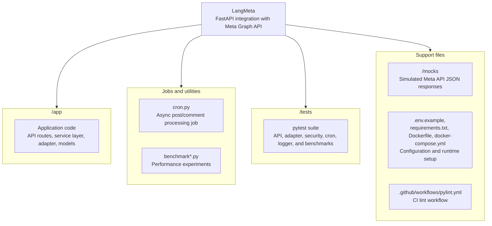
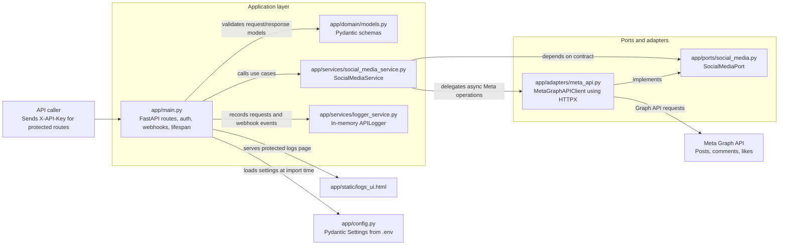
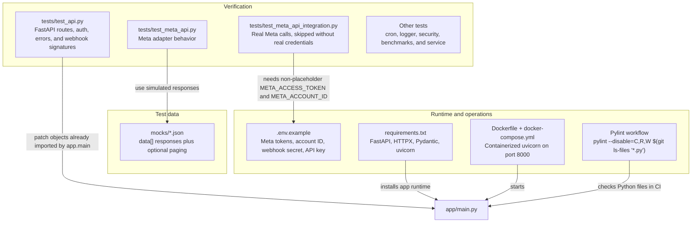

# Meta Graph API Integration

This is a FastAPI project designed to interact with the Meta Graph API for a specific account. The application uses HTTPX for asynchronous external API requests, Pydantic for data validation and settings management, and follows a hexagonal architecture (Ports and Adapters). Future integrations include LangChain support.

## Features

- **Fetch Posts:** Retrieve recent posts from the configured Meta account.
- **Manage Comments:** Retrieve comments for specific posts, and create new comments.
- **Likes Interaction:** Retrieve likes for posts and comments, and add likes to comments.
- **Webhook Handling:** Receive and verify real-time updates and notifications from Meta/Instagram webhooks.

## Architecture
The repository follows a Ports and Adapters (hexagonal) architecture style, structurally organized into application logic and external adapters (e.g., the Meta Graph API client).







## Prerequisites
- Python 3.9+
- Docker & Docker Compose (optional, for containerized deployment)

## Setup

### Local Setup
1. Clone the repository.
2. Install the required dependencies:
   ```bash
   pip install -r requirements.txt
   ```
3. Copy the `.env.example` file to create your `.env` configuration file:
   ```bash
   cp .env.example .env
   ```
4. Fill out the variables in `.env` with your Meta API credentials.

To generate the local API key used by protected endpoints, run:
```bash
openssl rand -hex 32
```
Then set the generated value in `.env`:
```env
API_KEY=your_generated_key_here
```

For a detailed walkthrough of all required keys, see [`API_KEYS_GUIDE.md`](API_KEYS_GUIDE.md). An English version is available at [`API_KEYS_GUIDE_EN.md`](API_KEYS_GUIDE_EN.md).

### Configuration
Update the `.env` file with your specific Meta app configuration:
- `META_ACCESS_TOKEN`: The user or page access token.
- `META_ACCOUNT_ID`: The ID of the specific account you want to query.
- `META_API_VERSION`: Graph API version (default is `v19.0`).
- `META_WEBHOOK_VERIFY_TOKEN`: A custom token used to verify the webhook setup (only needed if using webhooks).
- `META_APP_SECRET`: Your Meta App Secret, used to verify the payload signature of incoming webhooks.
- `API_KEY`: A local secret used to protect application endpoints. Send it in the `X-API-Key` header when calling protected routes.

## Running the Application

### Using Uvicorn (Local)
Run the FastAPI application locally using uvicorn:
```bash
uvicorn app.main:app --reload
```
The server will typically start on `http://127.0.0.1:8000`. You can access the automatic API documentation at `http://127.0.0.1:8000/docs`.

### Using Docker Compose
You can build and orchestrate the application using Docker Compose. Make sure your `.env` is configured.
```bash
docker-compose up --build
```
The application will be exposed on port `8000`.

## API Endpoints Summary

- `GET /health` - Health check endpoint.
- `GET /posts` - Get account posts.
- `GET /{object_id}/likes` - Get likes for a specific post or comment.
- `GET /webhook` - Webhook verification endpoint (Hub Challenge).
- `POST /webhook` - Webhook notification endpoint for incoming events.
- `GET /posts/{post_id}/comments` - Get comments for a specific post.
- `POST /posts/{post_id}/comments` - Post a new comment on a specific post.
- `POST /comments/{comment_id}/like` - Like a specific comment.

*Note: All Meta interaction endpoints (except `/health` and `/webhook`) may require authentication or assume that valid configuration is present in the application's context depending on your security setup (like API Key validation, if implemented).*

## API Usage Examples

Here are some `curl` examples for interacting with the main API endpoints:

### Health Check
```bash
curl -X GET "http://127.0.0.1:8000/health"
```

### Get Account Posts
Retrieve recent posts from the configured Meta account:
```bash
curl -X GET "http://127.0.0.1:8000/posts?limit=10"
```

### Get Likes for a Post or Comment
```bash
curl -X GET "http://127.0.0.1:8000/123456789/likes?limit=10"
```

### Get Comments for a Post
```bash
curl -X GET "http://127.0.0.1:8000/posts/123456789/comments?limit=10"
```

### Post a New Comment
```bash
curl -X POST "http://127.0.0.1:8000/posts/123456789/comments" \
     -H "Content-Type: application/json" \
     -d '{"message": "Great post!"}'
```

### Like a Comment
```bash
curl -X POST "http://127.0.0.1:8000/comments/987654321/like"
```

## Testing

Testing is performed using `pytest`. The application expects to use fake data or adapters when appropriate to isolate the logic.
To run the test suite:
```bash
PYTHONPATH=. python3 -m pytest tests/
```
